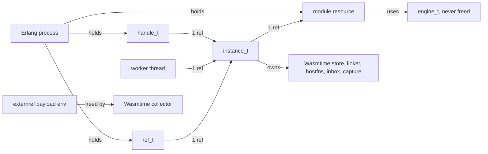

# Design

How the NIF is put together, for the person about to change it. The user
guides say what the library does; this says why it is built the way it is
and which rules a change must keep. Every claim here is about the code as
it is; when you change the code, change this page in the same commit.

## Read this first

The whole runtime rests on one rule:

> A Wasmtime store is used by exactly one thread at a time. While the guest
> runs, that thread is the instance's worker thread. At any other time it is
> whichever thread holds the instance mutex.

Everything that looks like a lock or a "busy" error is that rule applied.
Wasmtime itself has no thread affinity: a store may be driven from any
thread, but never from two at once.

## Where things are

| Task | Open |
|---|---|
| Add or change how a value crosses (numbers, v128, references) | `c_src/nif_values.c`, then `nif_refs.c` for GC objects |
| Change when a call starts, ends, is interrupted or cancelled | `c_src/nif_instance.c` (queue, worker, destructors) and `nif_call.c` |
| Change what an instance is given at creation (options, WASI, imports) | `c_src/nif_instantiate.c` |
| Change how host functions are served | `c_src/nif_host.c` and `run_host/4` in `src/wasmtime.erl` |
| Change streams (stdin/stdout, the `erlang` imports) | `c_src/nif_stream.c` |
| Change engine settings, compile options, precompiled compatibility | `c_src/nif_engine.c` and `compile_key/1` in `src/wasmtime.erl` |
| Add a NIF entry point | `c_src/nif_api.c`, then [CONTRIBUTING.md](../CONTRIBUTING.md) |
| Change the build, the download, the archives | `scripts/`, [building](building.md), [RELEASING.md](../RELEASING.md) |

`c_src/nif.h` holds every struct and the prototypes shared between files.
`src/wasmtime.erl` is the public API and owns defaults and option
validation; `src/wasmtime_nif.erl` is only the NIF stub table. Options
reach the NIF as maps read by key (`parse_options`, `configure_wasi` in
`nif_instantiate.c`), never by tuple position, so the two sides cannot
drift silently: a missing or ill-typed key is `badarg` naming the key.

## Ownership

| Object | Kept alive by | Destructor runs on | Destructor may |
|---|---|---|---|
| `module_res_t` | Erlang terms, every instance made from it | a scheduler | delete the Wasmtime module |
| `engine_t` | the registry (never freed until unload) | unload | delete the engine |
| `handle_t` | Erlang terms | a scheduler | set `stopping`, interrupt the running request, release its instance reference. Never wait for the thread. |
| `instance_t` | the handle, the worker thread, every `ref_t` | whichever drops the last reference | free everything: the thread has exited (it releases its reference as its last act), so nothing else can touch the store |
| `ref_t` | Erlang terms | a scheduler | unroot (`wasmtime_*_unroot` takes no context and only drops a liveness `Arc`), release its instance reference |
| externref payload (`payload_t`) | the Wasmtime GC object | Wasmtime's collector, any thread | free the env; it gets no store |

Rules that follow:

- A message never carries a resource term. Every message carries the
  Erlang reference made at instantiate time (`#instance.ref`, copied into
  `inst->ref_env`), so a worker thread cannot resurrect a resource from a
  mailbox. Refs (`ref_t`) do travel in messages as results and host call
  arguments; they are ordinary resources whose lifetime is by refcount.
- No destructor blocks. `handle_dtor` signals; `instance_dtor` runs only
  when the thread is gone; `ref_dtor` needs no lock.
- The worker thread is detached and owns one instance reference. The
  handle owns the other. A failed instantiate sets `stopping` so the
  thread exits and releases its reference; the handle still exists (the
  Erlang side got an error and drops it).

## The instance state machine

State lives in `instance_t` under `inst->mu`; `inst->cv` is the one
condition variable, broadcast whenever something a waiter cares about
changed.

| Field | Meaning |
|---|---|
| `queue.state` | `ST_IDLE` (no request), `ST_RUNNING` (guest executing on the worker), `ST_IN_HOST` (guest parked in a host function, store usable by the mutex holder) |
| `queue.head`, `queue.tail`, `queue.current` | the request queue and the request being served |
| `queue.stopping` | no request will ever start again; the worker exits when the queue drains |
| `host.abort` | the current request must end: set by `stop_current`, read by host and stream waits |
| `interrupt` (atomic) | same signal for the guest itself, read by the epoch callback every 10 ms |
| `req->cancelled` | the caller does not want the result (died or timed out): run nothing if not started, send nothing if running |
| `host.has_reply`, `host.reply` | the host call answer arrived |
| `interrupted_fired`, `host.failed`, `host.msg` | how the running request ended, worker thread only, read by `outcome` |
| `wasm.instantiated` | the store holds a live instance; false before `do_instantiate` succeeds |

Transitions, by who makes them:

| Entry point | Thread | Does |
|---|---|---|
| `enqueue` | scheduler | refuses when `stopping`; refuses `reentrant` when `state == ST_IN_HOST` and the caller is the process serving that host call; monitors the caller; appends; broadcasts |
| `worker_main` | worker | pops; skips `cancelled`; `ST_RUNNING`, clears `abort`, `interrupt`, `interrupted_fired`, `host_failed`; runs; `ST_IDLE`; sends the result unless `cancelled`; a failed instantiate sets `stopping` |
| `host_exchange` | worker (inside the guest) | `ST_IN_HOST` while waiting for `host_reply`, bounded by `host_timeout`; `abort` ends the wait as `interrupted`; back to `ST_RUNNING` |
| `inbox_wait` | worker (inside the guest) | waits on `cv` for bytes, `close/1` or `abort`; state stays `ST_RUNNING` |
| `nif_host_reply` | scheduler | stores the reply if `ST_IN_HOST` and the id matches; broadcasts |
| `stop_current` | any, with `mu` | sets `abort` and `interrupt`; broadcasts |
| `nif_interrupt` | scheduler | `stop_current` if a request runs |
| `nif_cancel` | scheduler | marks the request `cancelled` (running: also `stop_current`); the result is dropped in the NIF |
| `instance_down` | scheduler (monitor) | the dead process's running request is `cancelled` and stopped, its queued ones `cancelled` |
| `handle_dtor` | scheduler | `stopping`, current `cancelled`, `stop_current` |
| `epoch_callback` | worker (inside the guest) | if `interrupt`: fail the call with an `interrupted` error, else extend the deadline by one tick |

"Busy" for scheduler-side store access (`with_export`, `with_ref`,
`with_memory`, `nif_externref`, `nif_gc`): refused when `state ==
ST_RUNNING`. Allowed when idle or `ST_IN_HOST`, because then the guest is
parked and the mutex holder is the only user of the store. A host function
therefore may read memory, globals, tables and refs of the instance it
runs on, but may not call it (`enqueue` would queue behind itself).

`timeout` on `call/4` is implemented by the caller: `wait_result/3` calls
`cancel/2` after the timeout; `ok` means the result will never be sent,
`not_running` means it already is in the mailbox and is returned.
`settle/2` answers a host call that was in flight so nothing lingers.

## Message contracts

| Message | Sender | To | When |
|---|---|---|---|
| `{wasmtime_result, Ref, Id, Result}` | worker (`send_result`) | the request's caller | a request ended and was not cancelled |
| `{wasmtime_host_call, Ref, HostId, {Module, Name}, Args}` | worker (`host_exchange`) | the `host` process, or the caller for the start section | the guest called an import backed by Erlang |
| `{wasmtime_stream, Ref, stdout \| stderr \| channel, Bytes}` | worker (`stream_send`) | the `stream` process | the guest wrote to a `stream` stdio or called `erlang.send` |

Replies go the other way through NIFs, never messages: `host_reply/3`,
`send/2`, `close/1`. Terms in a message are built in a fresh
`enif_alloc_env` and sent with `enif_send(NULL, ...)`, the only way a
non-scheduler thread may send.

## Values

Two paths cross the boundary, chosen per function type by `shape_of`:

| Path | Wasmtime API | Carries | Why |
|---|---|---|---|
| raw | `wasmtime_func_call_unchecked`, `wasmtime_func_new_unchecked`, `wasmtime_val_raw_t` | i32, i64, f32, f64, v128 | the typed API aborts the process on v128 |
| typed | `wasmtime_func_call`, `wasmtime_func_new`, `wasmtime_val_t` | everything including references | the raw API hands out unrooted GC references and checks no types: a wrong reference is undefined behaviour |

A signature with both v128 and a reference cannot cross (`unsupported_type`).

Rules:

- Never call `wasm_valtype_kind`: it aborts on GC and non-nullable types.
  `vtype_of` reads `wasmtime_valtype_t` instead and gives the kind, the
  family (`FAM_NUM`, `FAM_EXTERN`, `FAM_FUNC`, `FAM_ANY`, `FAM_EXN`) and
  nullability.
- `term_to_val` always produces an owned root (a clone of the `ref_t`'s
  root, or a fresh `i31`). The caller unroots it (`unroot_vals`) unless the
  callee takes ownership. `wasmtime_func_call` does not take ownership of
  arguments; a typed callback's `results` are taken over by Wasmtime, and
  so are its `args`, which is why `host_callback_typed` clones before
  `val_to_term`.
- `val_to_term` consumes the value: the resulting `ref_t` owns the root.
  It returns 0 for a kind that cannot cross (`exnref`).
- The kind of a raw value always comes from the function type, never from
  the value.

## Engines and precompiled modules

One engine per distinct compile option set, in a registry keyed by
`{Fuel, OptLevel, SortedProposalOverrides}` (normalised by
`compile_key/1` on the Erlang side so equal maps mean the same engine),
capped at `MAX_ENGINES` (32) because engines are never freed. Every
engine has epoch interruption on and `concurrency_support` off; the ticker
thread bumps all of them every `EPOCH_TICK_NS`.

A `.cwasm` (`serialize/1`, `deserialize/1,2`) records the engine it was
made with. Wasmtime accepts it when:

| Recorded | Check |
|---|---|
| tunables (fuel, epoch, concurrency support, collector, memory layout) | exact |
| shared compiler flags (opt_level) | exact |
| WebAssembly features (proposals) | subset of the loading engine's |
| target triple | exact |
| ISA flags | subset of the host's |

Consequences: `deserialize/1` tries the default engine then the fuel one;
`deserialize/2` picks by options; a module compiled with proposals off
loads anywhere; the full and runtime-only libraries share `make_config`
so they accept the same files; the stdin shim shipped in `priv/shims`
must be compiled with the same settings, which is why
`scripts/precompile-shims.sh` mirrors `make_config` flag by flag and
`shim_files_load` in the tests fails when they drift.

## Streams

Every instance has one inbox (a list of byte chunks under `mu`).
`send/2` appends, `close/1` marks end of input. Two guest faces read it:

- the `erlang.recv` import, one whole chunk per call;
- stdin, when `stdin => stream`: a `fd_read` defined in the linker in
  front of WASI's own (`wasmtime_linker_allow_shadowing`), serving fd 0
  from the inbox as a byte stream.

Other fds must still reach Wasmtime's `fd_read`, but Wasmtime's WASI
functions find the guest memory through their *caller's* `memory` export,
and a host-to-host call has no caller. The shim module
(`scripts/stdin-shim.wat`, embedded as `SHIM_WASM`) imports the guest
memory, exports it as `memory` and forwards; the override calls the shim's
export. A full build compiles the shim once per engine; a runtime-only
build has no compiler and loads `priv/shims/<platform>-<plain|fuel>.cwasm`.

Output is push: the custom stdout/stderr callback (`stream_write`) and
`erlang.send` deliver one message per write; the mailbox is the buffer.
What a write is depends on the guest's C library: it fully buffers a
stdout it believes is a file, so a `stream` stdout or stderr also shadows
`fd_fdstat_get` and reports a character device without seek and tell
rights (wasi-libc's `isatty` test); musl then line-buffers and every line
is one message. The shim forwards both `fd_read` and `fd_fdstat_get`.

## Build pipeline

`scripts/fetch-wasmtime.sh` resolves the C API in this order: an explicit
`WASMTIME_C_API_DIR`; a cached archive; a download (this repo's release
for runtime-only and FreeBSD, upstream otherwise) checked against
`scripts/*.sha256`; a source build. `scripts/build-nif.sh` probes what the
library can do (`NIF_HAVE_COMPILER`, `_WAT`, `_WASI`, by `nm` or a link
test, cross-checked with `conf.h`), records the platform in
`priv/wasmtime_platform`, and rebuilds only when the stamp file
(`_build/wasmtime_nif.stamp`, the library path and flags) changed.

Decisions and their reasons:

| Decision | Reason |
|---|---|
| Download at build time, not in the hex package | hex caps a package at 8 MB; the full C API is 15 MB |
| Full library linked statically, runtime library shared | a static runtime build's LTO objects make an 8 MB NIF; shared it is 4 MB |
| Wasmtime's `min/` archives are not used | no WASI, no GC: they cannot load what the full build compiles |
| FreeBSD full library comes from this repo's release | Wasmtime publishes none |
| musl archives built with rustup targets and a `zig cc` wrapper | Alpine containers do not run on arm64 runners and Alpine's cargo is too old; the wrapper drops `--target=`, maps `-lgcc_s` to `-lunwind`, drops the Cortex-A53 erratum flag |
| `concurrency_support` off in every engine | the runtime library has no component model; the tunable is recorded in `.cwasm` files |
| Stdin shim compiled by the Wasmtime CLI | the C API has no precompile entry point, `module_new` refuses a foreign target, and each archive carries one Cranelift backend |
| Shims compiled with every proposal off and an explicit target | features are checked as a subset, ISA flags become baseline for the platform |
| Erlang never waits inside a NIF | one OS thread per instance, requests queued, results as messages; schedulers stay free |
| Raw value path kept next to the typed one | v128 needs raw, references need typed |

## Numbers

| Value | Where | Why | If you change it |
|---|---|---|---|
| 4 MB thread stack | `nif_instantiate` | Wasmtime runs the guest on the native stack (`max_wasm_stack` 512 KB) with our callbacks above it; macOS threads default to 512 KB | smaller: stack overflow inside deep guests on macOS; larger: address space only, not resident |
| 10 ms epoch tick | `EPOCH_TICK_NS` | interrupt latency vs. the cost of a global counter bump | the latency of `timeout` and `interrupt/1` |
| 32 engines | `MAX_ENGINES` | engines are never freed; a bound turns a leak into an error | `too_many_configurations` sooner or later |
| 32 values | `MAX_VALS` | stack arrays for arguments and results | signatures wider than this are `unsupported_type` |
| 30 s host timeout | `DEFAULT_HOST_TIMEOUT` | a guest parked forever behind a dead handler would pin its thread | how long a slow host fun may take before the guest traps |
| 16 MB inbox, 16 MB per captured stream | `DEFAULT_INBOX_LIMIT`, `DEFAULT_OUTPUT_LIMIT` | bound what a guest or a sender can queue without anyone reading | `inbox_full` and the dropped counters |
| 256 MB memory limit | `DEFAULT_MEMORY_LIMIT` | a guest is isolated by default; growing past this traps | the memory a guest may claim |
| 10 instances, 100 tables, 10 M elements | limits in `nif_options/3` | store limiter defaults matching Wasmtime's own | resource caps per store |
